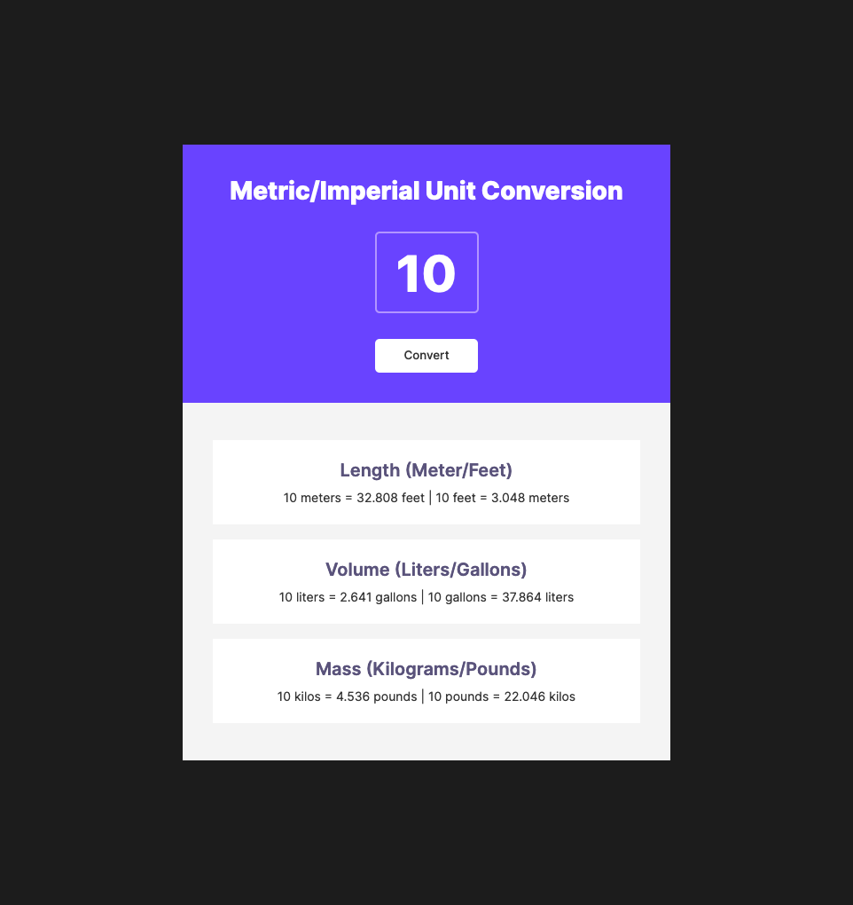

# Scrimba - Solo Project: Unit Convertor

This is a solution to the **Solo Project: Unit Convertor**.

## Table of contents

- [Overview](#overview)
  - [The challenge](#the-challenge)
  - [Screenshot](#screenshot)
  - [Links](#links)
- [My process](#my-process)
  - [Requirements](#requirements)
  - [Continued development](#continued-development)
  - [Useful resources](#useful-resources)
- [Author](#author)

## Overview

### The challenge

Users should be able to:

- View the optimal layout for the site depending on their device's screen size
- See hover states for all interactive elements on the page

### Screenshot

### Links

- Solution URL: [Add solution URL here](https://your-solution-url.com)
- Live Site URL: [Add live site URL here](https://your-live-site-url.com)

## My process

### Requirements

- Follow the design spec
- Generate all conversions when the user clicks 'convert'
- Round the numbers down to three decimal places

### Continued development

Stretch Goals:

- Add dark theme
- Switch between dark & light themes

### Useful resources

- [How To Hide Arrows From Input Number](https://www.w3schools.com/howto/howto_css_hide_arrow_number.asp)

## Author

- Website - [Katrien S](https://www.katriens.be)
- Twitter - [@graficdoctor](https://www.twitter.com/graficdoctor)
